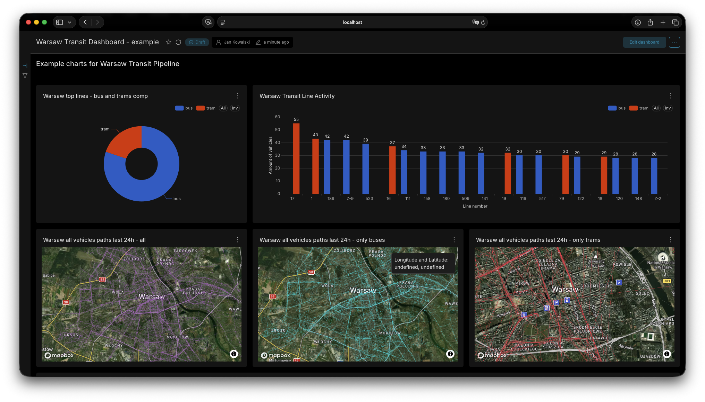
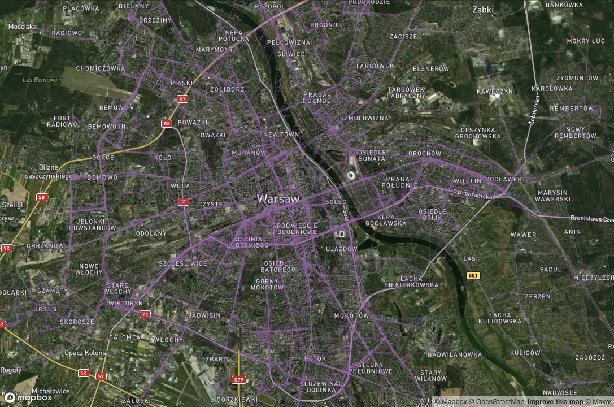
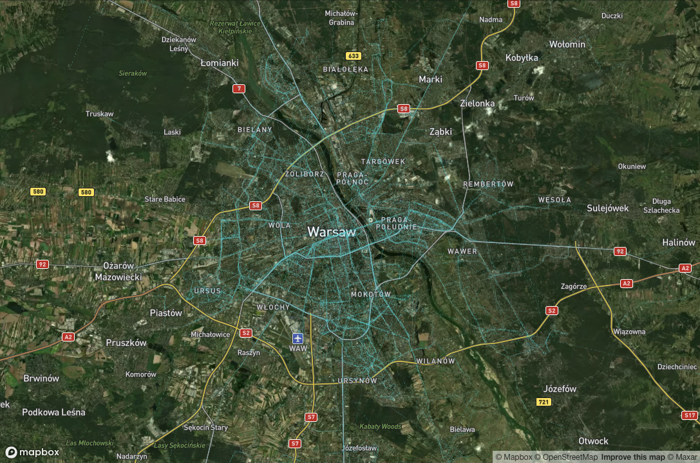
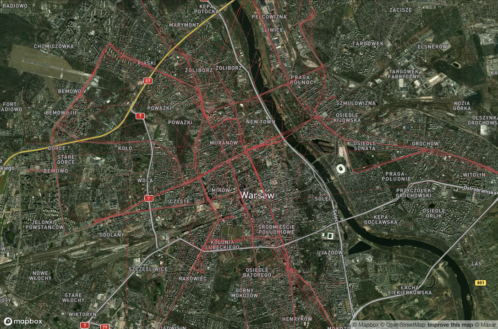
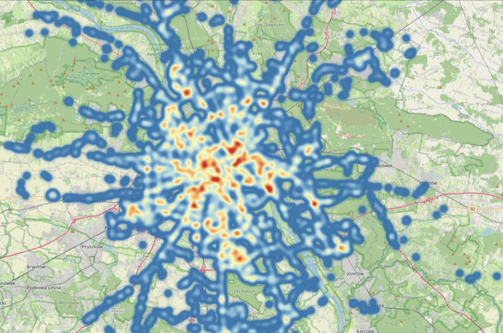
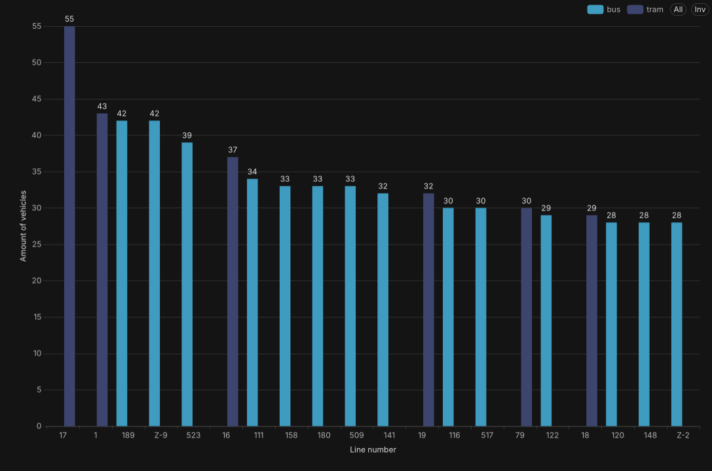
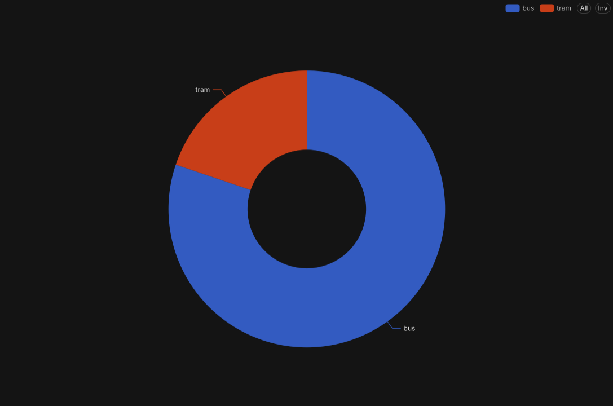
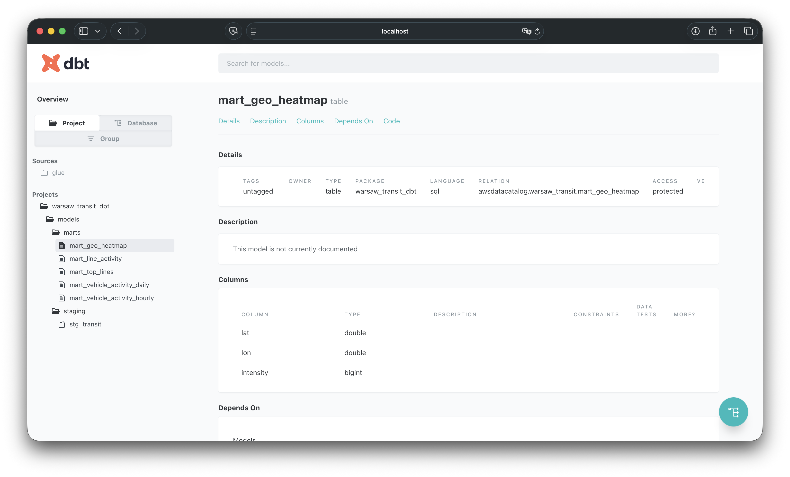

# Warsaw Public Transit Data Pipeline 🚌


An end-to-end Data Engineering pipeline that ingests real-time GPS data from [Warsaw's Public Transit (ZTM Warszawa)](https://dane.um.warszawa.pl/pl/catalogue), processes it using modern data stack tools, and visualizes it on interactive spatial dashboards.

---

## 🏗️ Architecture Overview

> **[PLACEHOLDER FOR YOUR ARCHITECTURE DIAGRAM]** > *(Insert your draw.io / Excalidraw architecture diagram here. Name it `architecture.png` and place it in the `img/` folder, then replace this text with ``)*

### The ELT Workflow:
1. **Extract & Load:** Python scripts orchestrate the extraction of real-time GPS data from the ZTM API and load the raw Parquet data directly into an **AWS S3**.
2. **Orchestration:** **Apache Airflow** schedules and monitors the extraction processes, ensuring data freshness.
3. **Data Cataloging & Query Engine:** **AWS Glue Data Catalog** manages the metadata and schema of the data lake, allowing **AWS Athena** to seamlessly query the raw S3 data directly without moving it to a traditional data warehouse.
4. **Transform:** **dbt (Data Build Tool)** connects to Athena, transforming raw telemetry data into structured data marts (calculating paths, aggregating volumes, generating heatmaps).
5. **Visualize:** **Apache Superset** serves as the BI layer, leveraging WebGL (Deck.gl) to render hundreds of thousands of GPS points as smooth, interactive map layers.
6. **Infrastructure as Code (IaC):** **Terraform** provisions and manages the entirety of the AWS cloud environment, ensuring reproducible deployments of EC2 instances, S3 buckets, Glue catalogs, and Athena configurations.

---

## 📊 Dashboard & Visualizations

The analytical layer was built using **Apache Superset**. I solved complex geospatial rendering issues (like Z-fighting and WebGL scaling) to create seamless Deck.gl Path maps.

### Main Operations Dashboard
An overview of the city's transit pulse, combining spatial data with aggregated metrics.


### Real-Time Vehicle Paths (Deck.gl)
Visualizing exact routes taken by vehicles. The paths dynamically scale and use multiple layered charts to differentiate transport modes without visual overlapping.
| All Vehicles | Buses Only | Trams Only |
| :---: | :---: | :---: |
|  |  |  |

### Traffic Heatmap & Top Lines
Identifying the most heavily trafficked corridors and the most active lines in the city using Treemaps and Geo Heatmaps.
| Congestion Heatmap | Most Active Lines (Treemap) | Fleet Distribution |
| :---: | :---: | :---: |
|  |  |  |

### Data Transformations (dbt)
The analytical logic is fully documented and tested using dbt.


---

## 📂 Repository Structure

```text
├── airflow/            # DAGs and Airflow configuration
├── dbt/                # dbt models (staging, marts) and schema tests
├── img/                # Dashboard screenshots and diagrams
├── src/                # Python ELT scripts (extraction, S3 loading)
├── superset/           # Dockerfiles, configs, and exported Dashboards-as-Code
├── terraform/          # IaC definitions for AWS deployment
├── docker-compose.yml  # Local AirFlow environment setup
├── Makefile            # Quick commands for running the project
└── pyproject.toml      # Python dependencies (managed via uv)
```

---

## 🚀 How to Run Locally

### Prerequisites
* Docker & Docker Compose
* AWS Account (with S3, AWS Glue, and Athena configured)
* ZTM Warsaw API Key
* Mapbox API Key (for Deck.gl maps)
* uv (recommended)

### 1. Clone & Setup Secrets
Clone the repository and create a `.env` file in the root directory:

```bash
git clone [https://github.com/Timoth26/warsaw-transit-pipeline.git](https://github.com/Timoth26/warsaw-transit-pipeline.git)
cd warsaw-transit-pipeline

# Add your credentials to the .env file
echo "MAPBOX_API_KEY=your_key_here" >> .env
echo "ZTM_API_KEY=your_key_here" >> .env
# Include AWS and ZTM credentials...
```

### 2. Start the Infrastructure
Remember to use your own variables in variables.tf

```bash
terraform apply
```

### 3. Run Airflow

```bash
make airflow-up
```

### 4. Run dbt Transformations
Once the Airflow DAG has loaded raw data to S3, run dbt to build the analytics engineering layer in Athena

```bash
dbt run
```

### 5. Run Superset

```bash
make superset-up
```
